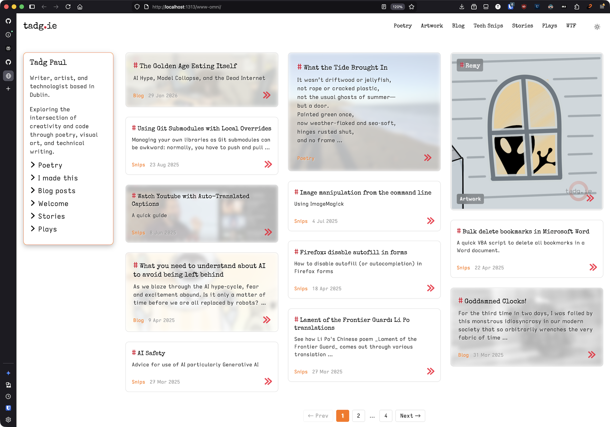
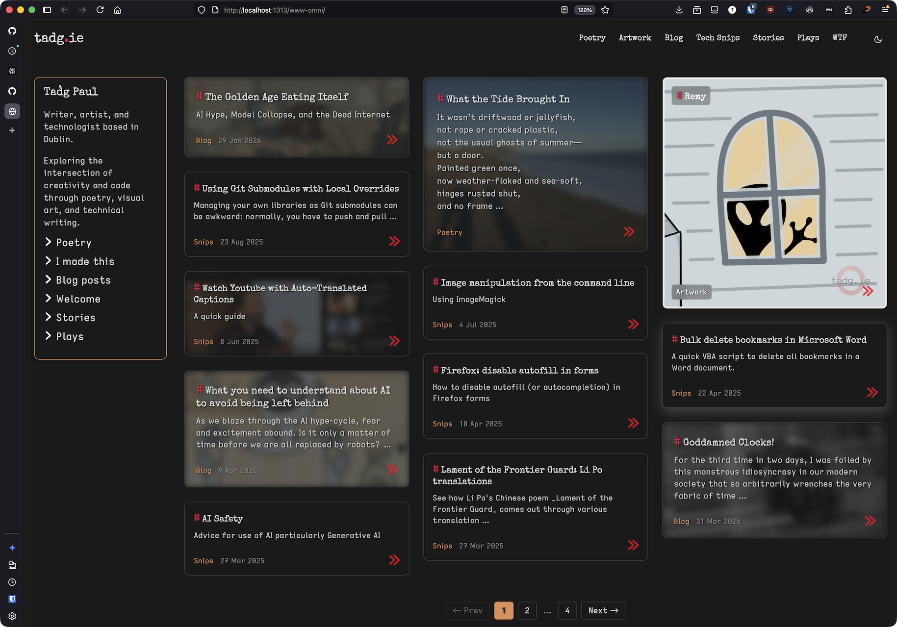
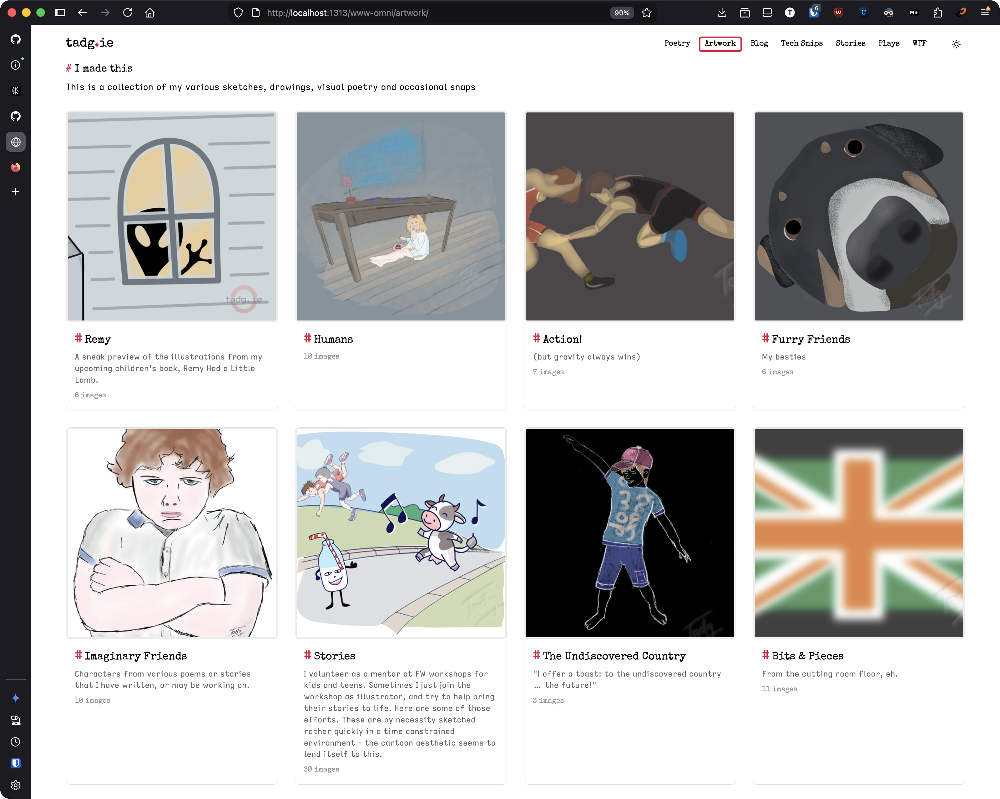
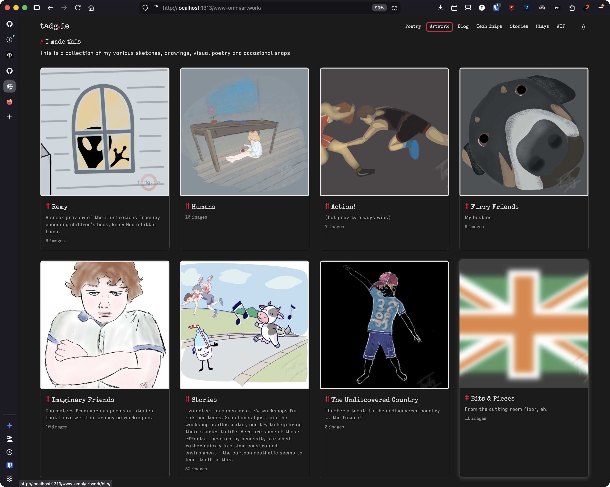

# tadg_ie Hugo Theme

Live demo: https://tadg.ie

# Screenshots
## Home page


## Gallery




A Hugo theme for multi-content-type sites with masonry layouts, galleries, and responsive design. Based on the Archie theme with extensive customizations.

## Features

- **Masonry grid layout** with CSS Grid fallback and JavaScript positioning
- **Image galleries** with lightbox and EXIF metadata support
- **Multiple content types** with section-agnostic design
- **Section-specific card styles** for each content type
- **Responsive design** with em-based breakpoints (WCAG 2.1 compliant)
- **Pagination** with per-section override
- **13 custom shortcodes** (callout, colorbold, contactform, details, dialogue, direction, formspree, gallery, poem, popquote, rawhtml, section-list, video)
- **Flexible sidebar** with content, shortcodes, or section navigation
- **Dark mode support** with system preference detection

## Quick Start

1. Add the theme to your Hugo site:
   ```bash
   git submodule add https://github.com/tigger04/theme-tadg-ie.git themes/tadg_ie
   ```

   Or clone directly:
   ```bash
   git clone https://github.com/tigger04/theme-tadg-ie.git themes/tadg_ie
   ```

2. Update your `hugo.yaml`:
   ```yaml
   theme: tadg_ie
   ```

3. Create content in sections matching your site structure (e.g., `blog/`, `portfolio/`, `gallery/`)

4. Run Hugo:
   ```bash
   hugo server
   ```

## Table of Contents

1. [Architecture Overview](#architecture-overview)
2. [Page Templates](#page-templates)
3. [Article Layouts](#article-layouts)
4. [Masonry Grid System](#masonry-grid-system)
5. [Section Display Configuration](#section-display-configuration)
6. [Pagination](#pagination)
7. [Section-Specific Behaviour](#section-specific-behaviour)
8. [Gallery System (Artwork)](#gallery-system-artwork)
9. [Shortcodes](#shortcodes)
10. [Configuration Options](#configuration-options)
11. [Index Files and Page Bundles](#index-files-and-page-bundles)
12. [Frontmatter Reference](#frontmatter-reference)
13. [CSS Customization](#css-customization)
14. [Social Icons (Footer)](#social-icons-footer)
15. [JavaScript Components](#javascript-components)
16. [Scripts](#scripts)
17. [Troubleshooting](#troubleshooting)

---

## Architecture Overview

The theme provides a complete set of templates:

```
themes/tadg_ie/
├── layouts/
│   ├── index.html             # Homepage template
│   ├── _default/
│   │   ├── baseof.html        # Base template wrapper
│   │   ├── single.html        # Article/page template
│   │   └── list.html          # Section list template
│   ├── artwork/
│   │   └── single.html        # Individual gallery page
│   ├── partials/
│   │   ├── grid-config.html   # Responsive grid CSS from params (Issue #17)
│   │   ├── masonry-grid.html  # Shared masonry grid component
│   │   ├── list-view.html     # Simple list layout
│   │   ├── gallery-section.html # Gallery grid layout
│   │   ├── pagination.html    # Pagination controls
│   │   └── ...
│   └── shortcodes/
│       └── ...
├── assets/
│   └── css/
│       ├── custom.css         # Theme customizations
│       ├── fonts.css          # Font definitions
│       └── lightbox.css       # Lightbox styling
├── scripts/
│   └── pins.pl               # List pinned content
└── static/
    └── js/
        ├── masonry-init.js    # Masonry layout
        ├── lightbox.js        # Image lightbox
        └── burger-menu.js     # Mobile nav
```

---

## Page Templates

### Homepage (`layouts/index.html`)

The homepage displays a masonry grid with pinned/featured content from each section.

**Pin Logic:**
1. For each section defined in `mainSections`, find pages with `pin` frontmatter
2. Select the page with the lowest `pin` value (e.g., `pin: 1` beats `pin: 10`)
3. If no pinned page exists, use the most recent page from that section
4. Pinned pages appear first in the grid, followed by remaining pages by date

**Structure:**
```html
<main class="home">
  <!-- Optional subtitle from site params -->
  <!-- Optional homepage content from _index.md -->
  <!-- Masonry grid with pinned + recent content -->
  <!-- Pagination for remaining content -->
</main>
```

### List Pages (`layouts/_default/list.html`)

Used for section index pages (`/poetry/`, `/blog/`, etc.) and taxonomy pages.

**Features:**
- Page header with title and optional description
- Optional content from `_index.md`
- Configurable display style (cards, list, gallery)
- Optional sidebar for subsection navigation
- Pagination with per-section override

### Single Pages (`layouts/_default/single.html`)

The article template supports multiple layout modes selected via the `layout` frontmatter field.

---

## Article Layouts

The `layout` frontmatter field controls how a single article is displayed. Available layouts:

### `banner`
Full-width banner image at the top with title overlay.

```yaml
layout: banner
image:
  src: my-image.jpg
  dark: true  # Optional: adds dark overlay for light text
  caption: "Photo by Example"  # Optional
```

### `hero`
Large featured image below the title.

```yaml
layout: hero
image:
  src: hero-image.jpg
  alt: "Description"
  caption: "Optional caption"
```

### `columns` / `featured-columns-left`
Two-column layout with image on the left, text on the right.

```yaml
layout: columns
image:
  src: side-image.jpg
```

### `featured-columns-right`
Two-column layout with text on the left, image on the right.

### `featured`
Inline featured image within the content flow.

### `background` (default when image present)
Background image behind the content with blur and opacity.

```yaml
layout: background
image:
  src: bg-image.jpg
  opacity: 0.3      # Override default
  blur: 10px        # Override default
  dark: true        # Dark mode variant
```

### No Layout (text-only)
When no `layout` is specified and no image exists, a simple text layout is used.

---

## Masonry Grid System

The masonry grid (`layouts/partials/masonry-grid.html`) is the core component for displaying content on homepages and list pages.

### How It Works

**Hybrid CSS Grid + JavaScript Approach:**

1. **CSS Grid** provides the responsive column structure:
   ```css
   grid-template-columns: repeat(auto-fill, minmax(17.5rem, 1fr));
   ```

2. **JavaScript** (`static/js/masonry-init.js`) adjusts vertical positioning to fill gaps using a shortest-column algorithm.

**Accessibility Note:** Both CSS media queries and JavaScript breakpoints use relative units (`em`/`rem`) rather than fixed pixels. This ensures the layout adapts when users change their browser's default font size (WCAG 2.1 Success Criterion 1.4.4).

### Responsive Breakpoints

Breakpoints and column counts are configurable via `params.grid` in `hugo.yaml` (see [Grid Configuration](#grid-configuration)). Defaults shown below:

| Viewport | Columns | With Sidebar |
|----------|---------|--------------|
| ≤ 48em   | 2       | Sidebar collapses to `<details>` toggle |
| 48-64em  | 3       | 2 + narrow sidebar = 3 total |
| 64-80em  | 4       | 3 + sidebar = 4 total |
| ≥ 80em   | 5       | 4 + sidebar = 5 total |

**Constraint:** Min 2, max 5 columns total (including sidebar when present).

Per-section overrides are supported via `grid` frontmatter in `_index.md` files. Page-level values override site-level defaults.

### Card Styles

Masonry cards have two layouts:

| Type     | When Used                    | Elements Shown                        |
|----------|------------------------------|---------------------------------------|
| Gallery  | `gallery: true` in frontmatter | Image-dominant with frosted glass text overlay |
| Default  | All other content             | Title, excerpt, date, section label, read-more link |

**CSS customization:** All cards include a `.masonry-{section}` class (e.g., `.masonry-blog`, `.masonry-gallery`) for section-specific styling via custom CSS. The theme itself treats all non-gallery content identically, but site owners can add custom styles for their specific sections.

### Background Images on Cards and List Items

Both masonry cards and list-view items display a background image when `image.src` is set in frontmatter (or `featured_image` / first image resource for gallery pages). The image is rendered with blur and opacity as configured in `params.bgImage`:
- Default opacity: 0.2 (20%)
- Default blur: 5px

This applies to all three display modes (`cards`, `list`, `gallery`) so that switching `list_style` preserves the visual treatment of article images.

On cards with background images (`.has-image`), the category and date metadata gets a frosted glass pill (`backdrop-filter: blur(8px)` with a semi-transparent background) to ensure legibility over the image. Cards without images are unaffected.

### Usage in Templates

```go-html-template
{{ partial "masonry-grid.html" (dict
    "pages" .Pages
    "showSection" true
    "Site" .Site
) }}
```

---

## Section Display Configuration

These frontmatter fields control how section list pages (`_index.md` / `_index.org`) display content:

```yaml
---
list_style: cards       # "cards" (default), "list", or "gallery"
sidebar: true           # true or false (default), or a map with content
list_recursive: false   # true or false (default)
paginate: 12            # items per page (default: 12)
---
```

**Note:** We use `list_style` (not `layout`) because Hugo reserves `layout` for template selection.

### Field Descriptions

| Field | Default | Description |
|-------|---------|-------------|
| `list_style` | `cards` | Display mode: `cards` (masonry grid), `list` (vertical list with background images), `gallery` (image grid) |
| `sidebar` | `false` | Show sidebar. Can be `true` (subsection nav), or a map with `title`, `content`, `sections`, `root` |
| `list_recursive` | `false` | Include all nested content recursively (uses `.RegularPagesRecursive`) |
| `paginate` | `12` | Items per page before pagination links appear |

### Sidebar Configuration

On viewports ≤ 48em (mobile/tablet), the sidebar collapses into a `<details>`/`<summary>` toggle with a ▼ chevron indicator. Users can tap to expand or collapse the navigation; expanded content pushes cards down in normal flow. On desktop, the sidebar title displays as a plain heading (no toggle affordance) and the sidebar fits its content width (capped at 20% viewport). A small inline script closes the sidebar on narrow viewports at page load and responds to orientation changes. The sidebar title defaults to "Navigation" but can be overridden with `sidebar.title`.

The sidebar is entirely configured via frontmatter. Two main modes:

#### Mode 1: Simple (`sidebar: true`)

Shows subsections of the current page automatically. Use this for section pages.

```yaml
# content/recipes/_index.md
sidebar: true
```

Result: Shows subsections of the current section (e.g., Starters, Mains, Desserts...)

#### Mode 2: Content-based (`sidebar.content`)

Full control via markdown and shortcodes. Use this for custom content like bios, or mixed layouts.

```yaml
# content/_index.md (homepage)
sidebar:
  title: "About"
  content: |
    Welcome to my site.

    

    Based in Dublin.
```

The `section-list` shortcode behaviour is consistent everywhere:
- `` → shows sections defined in `mainSections`
- `` → shows those specific sections

#### Mode 3: Explicit sections list

A simpler alternative to content-based when you just need section links:

```yaml
sidebar:
  title: "Browse"
  sections:
    - blog
    - portfolio
    - gallery
```

#### Mode 4: Root-based sibling navigation (`sidebar.root`)

Shows subsections of a specified root section. Use this for sibling navigation in deeply nested pages.

```yaml
# content/gallery/landscapes/_index.org
sidebar:
  root: gallery
```

Result: Shows all subsections of the root section (e.g., Landscapes, Portraits, Abstract...) regardless of which subsection you're viewing. This enables consistent navigation across sibling sections.

### Display Combinations

| list_style | sidebar | list_recursive | Result |
|------------|---------|----------------|--------|
| cards | false | false | Current default: masonry grid |
| cards | true | false | Sidebar + masonry grid |
| cards | true | true | Sidebar + all nested content as cards |
| list | false | false | Simple vertical list |
| list | true | false | Sidebar + list |
| gallery | false | false | Image gallery grid |
| gallery | true | false | Sidebar + gallery grid |

### Example Section Defaults

These are illustrative examples from the [demo site](https://tadg.ie). Adapt section names and settings to suit your site structure.

| Section | list_style | sidebar | Notes |
|---------|------------|---------|-------|
| Blog | cards | true | Sidebar for categories |
| Portfolio | cards | true | Sidebar for subsections |
| Notes | cards | true | Sidebar for topics |
| Stories | list | false | Simple list for narrative content |
| Gallery | gallery | true | Gallery grid with folder navigation |

---

## Pagination

Site-wide pagination default is set in `hugo.yaml`:

```yaml
pagination:
  pagerSize: 12   # Items per page (default)
```

Override per-section using `paginate` frontmatter field in section `_index.md` files:

```yaml
---
title: My Section
paginate: 20  # Show 20 items per page in this section
---
```

The pagination partial (`layouts/partials/pagination.html`) displays prev/next links and page numbers with ellipsis for large page counts.

---

## Section Examples

These examples show how the theme is used on the demo site (tadg.ie). You can organize your content with any section names - the theme adapts to your structure.

### Gallery Content (e.g., `/artwork/`)

Set `gallery: true` in frontmatter for image-dominant cards with overlay text. See [Gallery System](#gallery-system-artwork).

### Text Content (e.g., `/poetry/`, `/blog/`, `/plays/`)

All non-gallery content uses the same card layout:
- Title
- Excerpt/summary (150 characters)
- Date and section label
- Read-more link

Customize appearance using CSS:
```css
/* Custom styling for a "recipes" section */
.masonry-recipes .masonry-excerpt {
  font-style: italic;
}
```

### Collections (`/collections/`)

Example of grouping related content:
- Main page lists all collections
- Individual collection pages show their items
- Uses `collection` frontmatter to group content

---

## Gallery System (Artwork)

The artwork section uses the `` shortcode for flexible image display.

### Gallery List Page

Displays all gallery folders (subsections) with:
- Hero image for each gallery (first image or `featured_image`)
- Gallery title and description
- Image count badge

### Gallery Shortcode (`layouts/shortcodes/gallery.html`)

Any page can display its image resources as a gallery by including `` in its content.

**Features:**

1. **Metadata Priority:**
   - Frontmatter resource params (highest priority)
   - EXIF data (`DocumentName`, `ImageDescription`)
   - Filename (fallback)

2. **EXIF Metadata Extraction:**
   - `DocumentName` → Image title
   - `ImageDescription` → Image caption/description
   - Used for alt text and captions

3. **Responsive Images:**
   - Three sizes: 400px, 800px, 1600px
   - WebP format for modern browsers
   - Original format fallback
   - Lazy loading enabled

4. **Lightbox Integration:**
   - Click to open full-size image
   - Keyboard navigation (arrows, Escape)
   - Caption display from EXIF or frontmatter

### Gallery Frontmatter

```yaml
---
title: "Gallery Name"
description: "Gallery description"
params:
  featured_image: "hero.jpg"  # Optional: hero image for list page
resources:
  - src: "*.jpg"
    params:
      weight: 10  # Sort order
  - src: "special.jpg"
    params:
      title: "Custom Title"      # Overrides EXIF
      caption: "Custom caption"  # Overrides EXIF
---


```

---

## Shortcodes

> **Detailed reference with visual examples:** See [docs/shortcodes.md](docs/shortcodes.md) for the full shortcode reference including parameter tables and screenshot placeholders.

### ``

Styled alert/callout boxes with colour-coded types.

```markdown




```

**Types:** `tip`, `alert`, `warning`, `custom`

**Rendered output:**

```
┌──────────────────────────────────────┐
│ Tip                                  │
│ This is a helpful tip!               │  (green background)
└──────────────────────────────────────┘

┌──────────────────────────────────────┐
│ Alert                                │
│ Important alert message              │  (red background)
└──────────────────────────────────────┘

┌──────────────────────────────────────┐
│ Warning                              │
│ Warning message                      │  (yellow background)
└──────────────────────────────────────┘

┌──────────────────────────────────────┐
│ Custom Title                         │
│ Custom message                       │  (custom style)
└──────────────────────────────────────┘
```

### ``

Collapsible content block with a styled summary line. Closed state shows an ellipsis hint; open state reveals the full content.

```markdown

Hidden content goes here.
Can include **markdown**.

```

**Rendered output (closed):**

```
▸ Click to expand ···
```

**Rendered output (open):**

```
▾ Click to expand
┃ Hidden content goes here.
┃ Can include markdown.
```

### ``

Character speech for plays and screenplays. Character name renders in small caps with optional parenthetical (delivery direction) in italics.

Supports both positional and named parameters:

```markdown
Please don't shake off the water!
You've waited since yesterday, Tom.
Oh is that all?
```

**Parameters:**
- First positional or `name` — character name (required)
- Second positional or `parenthetical` — delivery direction (optional)

**Rendered output:**

```
  ᴛᴏᴍ (pleading)
  Please don't shake off the water!

  ᴀʟɪꜱᴏɴ
  You've waited since yesterday, Tom.

  ʙᴀʏᴀɴɪ (chuckling)
  Oh is that all?
```

### ``

Stage directions for plays. Renders in italics with secondary accent colour.

```markdown
A bare stage. Single chair centre. TOM enters.
Pause.
Lights fade.
```

**Rendered output:**

```
  A bare stage. Single chair centre. TOM enters.
  Pause.
  Lights fade.
```

(Italic text in the theme's secondary colour — orange in light mode, bright orange in dark mode.)

### ``

Expandable quote with styled summary. Uses the same collapsible styling as `details`.

```markdown

Full quote content here.
Multiple paragraphs supported.

```

**Rendered output (closed):**

```
▸ Opening line... ···
```

**Rendered output (open):**

```
▾ Opening line...
┃ Full quote content here.
┃ Multiple paragraphs supported.
```

### ``

Poetry formatting with preserved line breaks. Newlines in the source are converted to `<br />` tags so verse structure is maintained.

```markdown

Roses are red,
Violets are blue,
This preserves
Line breaks for you.

```

**Rendered output:**

```
Roses are red,
Violets are blue,
This preserves
Line breaks for you.
```

(Line breaks preserved exactly as written — no paragraph collapsing.)

### ``

Embed local video files with native HTML5 player controls.

```markdown

```

**Rendered output:**

```
┌──────────────────────────────────────┐
│                                      │
│           ▶  Video Player            │
│                                      │
│  ▶ advancement ━━━━━━━━━━ 🔊 ⛶     │
└──────────────────────────────────────┘
```

### ``

Self-hosted contact form with Cloudflare Turnstile CAPTCHA, Worker backend, and optional newsletter signup.

```markdown


```

**Rendered output:**

```
┌──────────────────────────────────────┐
│  Email:    [__________________________]│
│  Name:     [__________________________]│
│  Message:  [__________________________]│
│            [__________________________]│
│            [__________________________]│
│  ☐ Subscribe to newsletter           │
│                                      │
│  [Turnstile CAPTCHA widget]          │
│                          [ Send → ]  │
└──────────────────────────────────────┘
```

(Newsletter checkbox only appears with `newsletter="true"`.)

Requires Cloudflare Worker deployment and Hugo configuration. See [docs/contactform.md](docs/contactform.md) for full setup guide.

### ``

Embed a Formspree contact form (simpler alternative to `contactform` — no CAPTCHA, no self-hosting).

```markdown

```

**Rendered output:**

```
┌──────────────────────────────────────┐
│  Email:    [__________________________]│
│  Name:     [__________________________]│
│  ☐ Newsletter                        │
│  Message:  [__________________________]│
│                          [ Send → ]  │
└──────────────────────────────────────┘
```

### ``

Pass through raw HTML without markdown processing. Use for embedding widgets, iframes, or any HTML that Hugo's markdown renderer would alter.

```markdown

<div class="custom-widget">
  <iframe src="..."></iframe>
</div>

```

**Rendered output:** The HTML is passed through verbatim — whatever you write is what appears in the page source.

### ``

Renders a navigation list of site sections with chevron icons. Behaviour is consistent on any page (homepage, section pages, single pages).

```markdown



```

**Parameters:**
- `sections` — comma-separated list of sections (defaults to `site.Params.mainSections`)
- `limit` — show this many items per section (optional; omit for section links only)

**Rendered output:**

```
  › Poetry
  › Artwork
  › Blog
  › Stories
```

With `limit="3"`:

```
  › Poetry
      Recent poem title one
      Recent poem title two
      Recent poem title three
  › Blog
      Recent blog post one
      Recent blog post two
      Recent blog post three
```

| Usage | Shows |
|-------|-------|
| `` | All sections defined in `mainSections` |
| `` | Those specific sections |
| `` | Sections with up to 3 recent items each |

---

## Configuration Options

### Grid Configuration

The responsive grid is configurable via `params.grid` in `hugo.yaml`. All breakpoints use `em` units (WCAG 2.1 compliant — adapts to browser font size preferences). CSS media queries and JavaScript masonry both read from this single configuration source.

```yaml
params:
  grid:
    contentMaxWidth: 100rem       # max content area width
    sidebarWidth: 15rem           # sidebar column width at desktop
    sidebarWidthNarrow: 12rem     # sidebar column width at tablet
    gap: 1.5rem                   # grid gap between items
    breakpoints:
      sm: 30em                    # small / mobile
      md: 48em                    # medium / tablet
      lg: 64em                    # large / desktop
      xl: 80em                    # extra large / wide desktop
    columns:
      sm: 2                       # columns at small breakpoint
      md: 3                       # columns at medium breakpoint
      lg: 4                       # columns at large breakpoint
      xl: 5                       # columns at extra large breakpoint
```

All values above are the defaults. Omitting `params.grid` entirely produces identical behaviour.

**Per-section overrides:** Add a `grid` block to any section's `_index.md` frontmatter. Page-level values override site-level defaults:

```yaml
# content/photography/_index.md
---
title: Photography
grid:
  columns:
    xl: 6   # more columns for small thumbnails
---
```

**Implementation:** The `grid-config.html` partial generates a `<style>` block with CSS media queries and sets CSS custom properties (`--content-max-width`, `--sidebar-width`, `--grid-gap`). It also writes a `data-grid-config` JSON attribute on `<body>` that `masonry-init.js` reads for JavaScript layout calculations.

### `hugo.yaml` Settings

```yaml
baseURL: https://example.com/
title: Site Title
theme: tadg_ie

pagination:
  pagerSize: 12   # Items per page

params:
  # Browser tab title (overrides site title in <title> tag only)
  # Visual header always uses the top-level 'title' field
  browserTitle: "Author Name — Site Title"

  # Background image defaults for masonry cards
  bgImage:
    opacity: 0.2    # 0-1, transparency of background images
    blur: 5px       # CSS blur value

  # Read more button on masonry cards
  readMore:
    type: icon      # "icon" or "text"
    value: icons/chevron-right-duo-thick.svg  # icon path or text string

  # Theme mode: light, dark, auto, toggle
  mode: light

  # Main sections for homepage grid (use your own section names)
  mainSections:
    - blog
    - portfolio
    - gallery

  # CDN usage for fonts/libraries
  useCDN: false

  # Custom CSS files (loaded last)
  customcss:
    - css/custom.css
    - css/fonts.css
    - css/lightbox.css

  # Custom JavaScript files
  customJS:
    - js/burger-menu.js
    - js/lightbox.js

  # Social links (displayed as icons in the footer)
  social:
    - name: GitHub
      icon: github                    # Feather icon (default)
      url: https://github.com/username/
    - name: BlueSky
      icon: "simple:bluesky"          # Simple Icons (use simple: prefix)
      url: https://bsky.app/profile/username
    - name: Email
      icon: mail                      # Feather icon
      url: mailto:you@example.com

  # Optional features
  mathjax: false    # Enable MathJax
  katex: false      # Enable KaTeX

# Image processing
imaging:
  quality: 99
  resampleFilter: "CatmullRom"
  exif:
    disableDate: false
    disableLatLong: true  # Privacy: no GPS data
```

### Menu Configuration

```yaml
menu:
  main:
    - name: Blog
      url: /blog/
      weight: 10
    - name: Gallery
      url: /gallery/
      weight: 20
    # ...
```

---

## Index Files and Page Bundles

Hugo uses two types of index files to organize content.

### File Types Overview

| File | Type | Purpose | URL Example |
|------|------|---------|-------------|
| `_index.md` | Branch bundle | Section/list page metadata and content | `/poetry/` |
| `index.md` | Leaf bundle | Individual page content | `/poetry/my-poem/` |

### `_index.md` — Branch Bundles (Sections)

A `_index.md` (or `_index.org`) file defines metadata for a **section** or **list page**.

**Example:**
```yaml
---
title: Poetry
description: A collection of verses and musings
list_style: cards
sidebar: true
---

Welcome to my poetry section.
```

### `index.md` — Leaf Bundles (Individual Pages)

An `index.md` file defines an **individual content page** within a page bundle.

**Example:**
```yaml
---
title: That Day
date: 2004-05-01
layout: columns
image:
  src: sunset.jpg
---

Take me to that place in time...
```

### Org-mode Support

Both `.md` (Markdown) and `.org` (Org-mode) files are supported. Frontmatter in Org files uses the same YAML format.

---

## Frontmatter Reference

### Common Fields

```yaml
---
title: "Page Title"
date: 2025-01-15
draft: false
description: "Page description for SEO and previews"
author: "Author Name"
tags:
  - tag1
  - tag2
---
```

### Image Fields

```yaml
image:
  src: "image.jpg"        # Relative to page bundle
  alt: "Alt text"         # Accessibility
  caption: "Photo credit" # Displayed below image
  dark: false             # Dark mode variant flag
  opacity: 0.2            # Override default bg opacity
  blur: 5px               # Override default bg blur
```

### Layout Control

```yaml
layout: hero              # banner, hero, columns, featured, background
toc: true                 # Show table of contents as right sidebar
toc: "In this document"   # Custom TOC heading (defaults to "Table of contents:")
tldr: "Brief summary"     # TL;DR section at top
```

**Table of Contents:** When `toc: true`, the TOC appears as a sticky right-hand sidebar on wide screens (>60em), aligned horizontally with the article title. On narrow screens (≤ 60em), the article title and metadata appear above the TOC, followed by the article content — the title inside the post container is hidden to avoid duplication. Pages without `toc: true` use full-width layout with no extra column. Set `toc` to a string value to customise the heading text (e.g. `toc: "In this document"`); the default heading is "Table of contents:".

### Content Language

```yaml
contentLang: ga           # BCP 47 language tag (e.g. ga = Irish)
```

Sets the `lang` attribute on the `<article>` element (and masonry cards). The CSS `:lang(ga)` pseudo-class applies the Iosevka Gaeilge font to all descendants. Screen readers also use this for correct pronunciation. Note: Hugo's built-in `lang` front matter field is deprecated since v0.144.0, so this theme uses `contentLang` instead.

For inline Irish text within any article, use the `ga` shortcode:

```markdown
He greeted her with Dia duit, a chara as she entered.
```

### Pin/Featured

```yaml
pin: 1                    # Lower number = higher priority
```

### Exclude from Listings

```yaml
build:
  list: false             # Hide from list pages (homepage, section indexes)
```

Use this to exclude a page from appearing in:
- Homepage masonry grid
- Section list pages
- RSS feeds

The page remains accessible via direct URL and is included in the sitemap. This is Hugo's standard build option (not a custom field).

### Section Display (for `_index.md`)

```yaml
list_style: cards         # cards, list, or gallery
sidebar: true             # Show subsection navigation
list_recursive: false     # Include nested content
paginate: 12              # Items per page
```

### Gallery-Specific

```yaml
gallery: true             # Mark as gallery folder (enables image-dominant card layout)
featured_image: "hero.jpg"
sort_by: Date
sort_order: desc
```

**Gallery behavior:** Setting `gallery: true` in frontmatter enables special rendering for image galleries. This works in any section (not just "artwork"). Gallery cards display with an image-dominant layout and frosted glass text overlay on masonry grids and homepage.

---

## CSS Customization

### CSS Variables (Light Mode)

```css
:root {
  --text-color: #000;
  --text-secondary: #333;
  --text-muted: #666;
  --bg-color: #fff;
  --bg-secondary: #f5f5f5;
  --bg-hover: #f1f1f1;
  --border-color: #ddd;
  --accent-color: hsl(27, 100%, 35%);
  --link-color: #007acc;
  --content-max-width: 100rem;    /* configurable via params.grid */
  --sidebar-width: 15rem;         /* configurable via params.grid */
  --sidebar-width-narrow: 12rem;  /* configurable via params.grid */
  --grid-gap: 1.5rem;             /* configurable via params.grid */
}
```

### Dark Mode

Supports both system preference (`prefers-color-scheme: dark`) and manual toggle (`data-theme="dark"`).

### Key Classes

| Class | Purpose |
|-------|---------|
| `.masonry-grid` | Container for masonry layout |
| `.masonry-item` | Individual grid item |
| `.masonry-{section}` | Section-specific styling |
| `.masonry-bg` | Background image layer (masonry cards) |
| `.list-view-bg` | Background image layer (list items) |
| `.list-view-content` | Content wrapper above background (list items) |
| `.gallery-grid` | Gallery image container |
| `.gallery-item` | Individual gallery image |
| `.lightbox` | Lightbox overlay |
| `.sidebar-collapse` | Collapsible `<details>` wrapper for mobile sidebar |
| `.sidebar-collapse-title` | `<summary>` toggle — plain heading on desktop, tap target on mobile |
| `.toc-mobile-title` | Mobile-only article title shown above TOC (hidden on desktop) |
| `.pagination` | Pagination container |
| `.pagination-link` | Pagination button |

---

## Social Icons (Footer)

The footer displays social links as icons, configured via `params.social` in `hugo.yaml`.

### Icon Systems

Two icon sets are supported:

| Format | Example | Icon Set | Rendering |
|--------|---------|----------|-----------|
| `icon: github` | Feather icon (default) | [Feather Icons](https://feathericons.com/) | SVG sprite (`<svg><use>`) |
| `icon: "simple:bluesky"` | Simple Icons (`simple:` prefix) | [Simple Icons](https://simpleicons.org/) | Icon font (`<i class="si si-bluesky">`) |

Use Feather for common icons (`github`, `twitter`, `mail`, `instagram`, `linkedin`, etc.). Use Simple Icons with the `simple:` prefix for platforms not in the Feather set (e.g., `bluesky`, `mastodon`).

### Configuration Example

```yaml
params:
  useCDN: false          # false = local assets (default), true = CDN
  social:
    - name: BlueSky
      icon: "simple:bluesky"    # Simple Icons (not in Feather set)
      url: https://bsky.app/profile/username
    - name: Instagram
      icon: instagram           # Feather icon
      url: https://www.instagram.com/username/
    - name: GitHub
      icon: github              # Feather icon
      url: https://github.com/username/
    - name: Email
      icon: mail                # Feather icon
      url: mailto:you@example.com
```

### Assets

- **Feather sprites:** `assets/svg/feather-sprite.svg` (local) or unpkg CDN
- **Simple Icons font:** `static/fonts/SimpleIcons.woff2` + `assets/css/simple-icons.css`
- The Simple Icons CSS is only loaded when at least one `simple:` icon is configured

### Copyright

The footer also displays a copyright line from the site-level `copyright` field:

```yaml
copyright: "Your Name. All rights reserved."
```

Rendered as: `{copyright text} |`

---

## JavaScript Components

### Masonry Layout (`static/js/masonry-init.js`)

**Purpose:** Positions masonry items using shortest-column algorithm.

**Features:**
- Responsive column calculation using em-based breakpoints
- Waits for images to load before positioning
- Debounced resize handling
- Falls back to CSS Grid for single column

**Public API:**
```javascript
window.masonryLayout();  // Re-run layout
window.masonryInit();    // Full re-initialization
```

### Lightbox (`static/js/lightbox.js`)

**Purpose:** Full-screen image viewing for galleries.

**Features:**
- Click to open, click outside to close
- Keyboard navigation (←, →, Escape)
- WebP source detection for best quality
- EXIF-based captions

### Burger Menu (`static/js/burger-menu.js`)

Mobile navigation toggle.

---

## Scripts

Utility scripts live in `scripts/`. Run them from the root of your Hugo project.

### `scripts/pins.pl`

Lists all content files with a `pin:` value in their frontmatter, sorted numerically. Useful for reviewing pin assignments before reordering or adding new ones.

```bash
$ themes/tadg_ie/scripts/pins.pl
Pin  File
---  ------------------------------------------------
100  blog/2026-01-29-dark-optimism-ai/index.org
200  artwork/remy/_index.org
300  poetry/secrets/quadriplegia/index.md
400  poetry/secrets/what-the-tide-brought-in/index.md

4 pinned item(s)
```

**Requirements:** Perl 5 (standard on macOS and Linux).

**Detection:** The script checks for a Hugo config file (`hugo.yaml`, `hugo.toml`, `config.yaml`, etc.) in the current directory. It also works from within the `content/` tree. Running it elsewhere produces an error:

```
This must be run from the root of a Hugo project or its content directory.
```

### `scripts/org-play-to-shortcodes.pl`

Converts orgmode play scripts to use Hugo shortcodes for dialogue and stage directions. Modifies files in-place, so commit changes first.

**Conversions:**
- `*** Stage direction` → `Stage direction`
- `**** CHARACTER text` → `text`
- `**** CHARACTER direction` → `text`

All other content (frontmatter, `*` and `**` headers, bullet points, regular text) is preserved unchanged.

```bash
$ themes/tadg_ie/scripts/org-play-to-shortcodes.pl content/plays/myplay/index.org
Converted to shortcodes: content/plays/myplay/index.org
```

**Requirements:** Perl 5 with standard modules (utf8, strict, warnings).

**Usage:** Run from anywhere, passing the path to your orgmode play file. Use `--help` for full documentation.

---

## Troubleshooting

### Images Not Displaying

1. **Check path:** Image paths should be relative filenames for page bundles
   ```yaml
   # Correct (page bundle)
   image:
     src: my-image.jpg

   # Incorrect
   image:
     src: /posts/old-path/my-image.jpg
   ```

2. **Run tests:** `make test` validates image paths

### Masonry Not Working

1. Check browser console for JS errors
2. Ensure `masonry-init.js` is loaded
3. Verify `.masonry-grid` container exists
4. Check images have loaded (lazy loading delay)

### Gallery Images Missing Captions

EXIF metadata must include `DocumentName` or `ImageDescription` tags.

### Dark Mode Not Toggling

Ensure both CSS files are loaded:
- `css/main.css` (base)
- `css/dark.css` (dark mode)

### Pagination Not Appearing

- Pagination only shows when there are more items than `pagerSize`
- Check that `paginate` frontmatter value is a positive integer
- Verify the section has enough content pages

---

## License

MIT License. See [LICENSE](LICENSE) for details.

Based on the [Archie theme](https://github.com/athul/archie) by Athul Cyriac Ajay.
