# Shortcodes Reference

The tadg_ie theme provides 15 custom shortcodes for varied content types.

## Table of Contents

1. [callout](#callout) — Styled alert/notice boxes
2. [colorbold](#colorbold) — Inline accent-coloured bold text
3. [details](#details) — Collapsible content
4. [dialogue](#dialogue) — Character speech for plays
5. [direction](#direction) — Stage directions
6. [ga](#ga) — Inline Irish language text
7. [popquote](#popquote) — Expandable quotes
8. [poem](#poem) — Poetry with preserved line breaks
9. [video](#video) — HTML5 video player
10. [contactform](#contactform) — Self-hosted contact form with CAPTCHA
11. [formspree](#formspree) — Formspree-backed contact form
12. [rawhtml](#rawhtml) — Raw HTML pass-through
13. [section-list](#section-list) — Section navigation list
14. [img](#img) — Inline image with responsive thumbnails
15. [gallery](#gallery) — Image gallery with lightbox

---

## callout

Styled alert/callout boxes with colour-coded types.

### Parameters

| Parameter | Required | Description |
|-----------|----------|-------------|
| `type` | Yes | One of: `tip`, `alert`, `warning`, `custom` |
| `text` | Yes | Message content |
| `title` | No | Custom title (only for `type="custom"`) |
| `style` | No | Inline CSS (only for `type="custom"`) |

### Usage

```markdown




```

### Visual Examples

#### Light mode

| Tip | Alert |
|-----|-------|
| 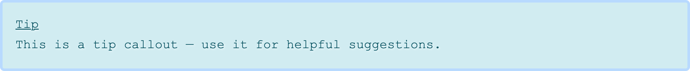 | 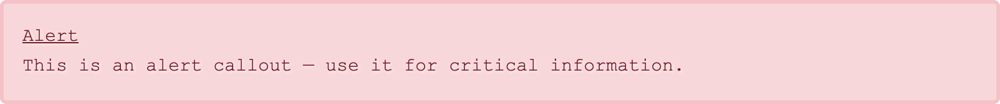 |

| Warning | Custom |
|---------|--------|
| 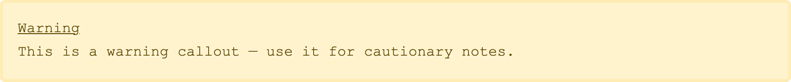 | 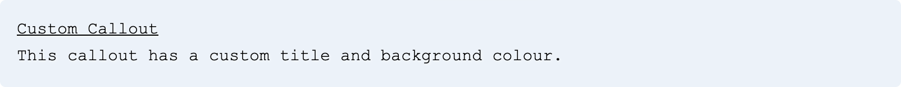 |

#### Dark mode

| Tip | Alert |
|-----|-------|
|  |  |

| Warning | Custom |
|---------|--------|
|  | 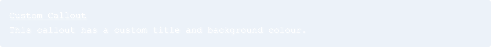 |

---

## colorbold

Inline text rendered in the secondary accent colour (`--color-secondary`) and bold. Underlined by default. Designed for emphasis within a sentence.

### Parameters

| Parameter | Required | Description |
|-----------|----------|-------------|
| First positional or `text` | Yes | Text to display |
| `underlined` | No | Set to `"false"` to remove underline (default: `true`) |

### Usage

```markdown
Are these only  I'm meant to frame?
This has  here.
```

### Visual Examples

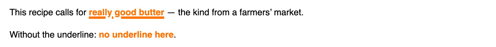

---

## details

Collapsible content block. Closed state shows an ellipsis hint; open state reveals full content.

### Parameters

| Parameter | Required | Description |
|-----------|----------|-------------|
| First positional | Yes | Summary/title text (supports markdown) |
| Inner content | Yes | Body content (supports markdown) |

### Usage

```markdown

Hidden content goes here.
Can include **markdown**.

```

### Visual Examples

| Collapsed | Expanded |
|-----------|----------|
|  | 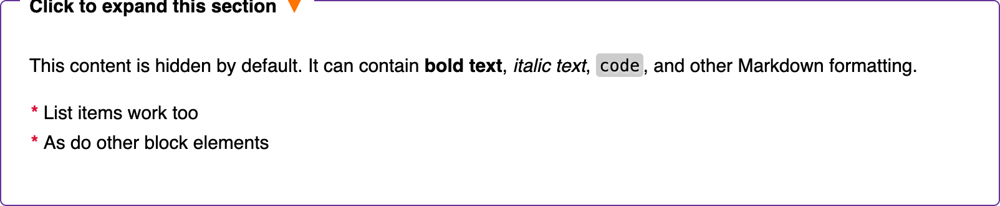 |

---

## dialogue

Character speech for plays and screenplays. Character name renders in small caps with optional parenthetical (delivery direction) in italics.

### Parameters

| Parameter | Required | Description |
|-----------|----------|-------------|
| First positional or `name` | Yes | Character name |
| Second positional or `parenthetical` | No | Delivery direction |
| Inner content | Yes | Dialogue text |

Supports both positional and named parameters.

### Usage

```markdown
Please don't shake off the water!
You've waited since yesterday, Tom.
Oh is that all?
```

### Visual Examples

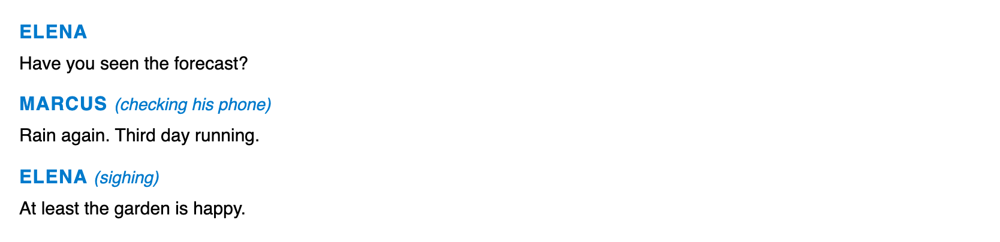

---

## direction

Stage directions for plays. Renders in italics with secondary accent colour.

### Parameters

| Parameter | Required | Description |
|-----------|----------|-------------|
| Inner content | Yes | Stage direction text (supports markdown) |

### Usage

```markdown
A bare stage. Single chair centre. TOM enters.
Pause.
```

### Visual Examples

| Light mode | Dark mode |
|------------|-----------|
| 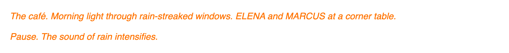 |  |

---

## ga

Inline Irish language text. Wraps content in `<span lang="ga">`, triggering the `:lang(ga)` CSS rule which applies Iosevka Gaeilge (wedge serif variant). Use this for Irish words or phrases within English text. For whole articles in Irish, use `contentLang: ga` in front matter instead.

### Parameters

| Parameter | Required | Description |
|-----------|----------|-------------|
| Inner content | Yes | Irish language text |

### Usage

```markdown
He greeted her with Dia duit, a chara as she entered.
The word craic has no direct English equivalent.
```

### Visual Examples

*Screenshot requires example content using the `ga` shortcode. Add `Dia duit` to a page to see Iosevka Gaeilge rendering.*

---

## popquote

Expandable quote using the same collapsible styling as `details`.

### Parameters

| Parameter | Required | Description |
|-----------|----------|-------------|
| First positional | Yes | Opening/summary text |
| Inner content | Yes | Full quote content (supports markdown) |

### Usage

```markdown

Full quote content here.
Multiple paragraphs supported.

```

### Visual Examples

| Collapsed | Expanded |
|-----------|----------|
|  | 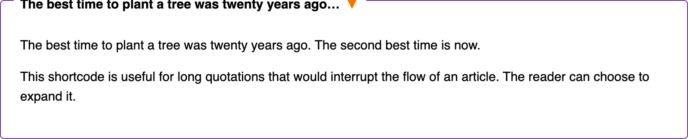 |

---

## poem

Poetry formatting with preserved line breaks. Newlines in source convert to `<br />` tags so verse structure is maintained.

### Parameters

| Parameter | Required | Description |
|-----------|----------|-------------|
| Inner content | Yes | Poem text with line breaks |

### Usage

```markdown

Roses are red,
Violets are blue,
This preserves
Line breaks for you.

```

### Visual Examples

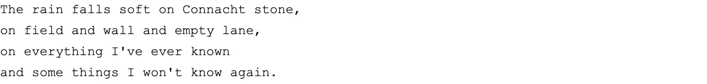

---

## video

Embed local video files with native HTML5 player controls.

### Parameters

| Parameter | Required | Description |
|-----------|----------|-------------|
| First positional | Yes | Video source URL |

### Usage

```markdown

```

### Visual Examples

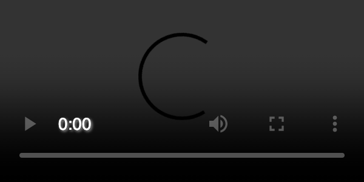

---

## contactform

Self-hosted contact form with Cloudflare Turnstile CAPTCHA, Worker backend, and optional newsletter signup.

Requires Cloudflare Worker deployment and Hugo configuration. See [contactform.md](contactform.md) for the full setup guide.

### Parameters

| Parameter | Required | Description |
|-----------|----------|-------------|
| `newsletter` | No | Set to `"true"` to show newsletter checkbox |

### Site Configuration Required

```yaml
params:
  contactform:
    worker_url: "https://your-worker.example.workers.dev"
    turnstile_sitekey: "0x..."
```

### Usage

```markdown


```

### Visual Examples

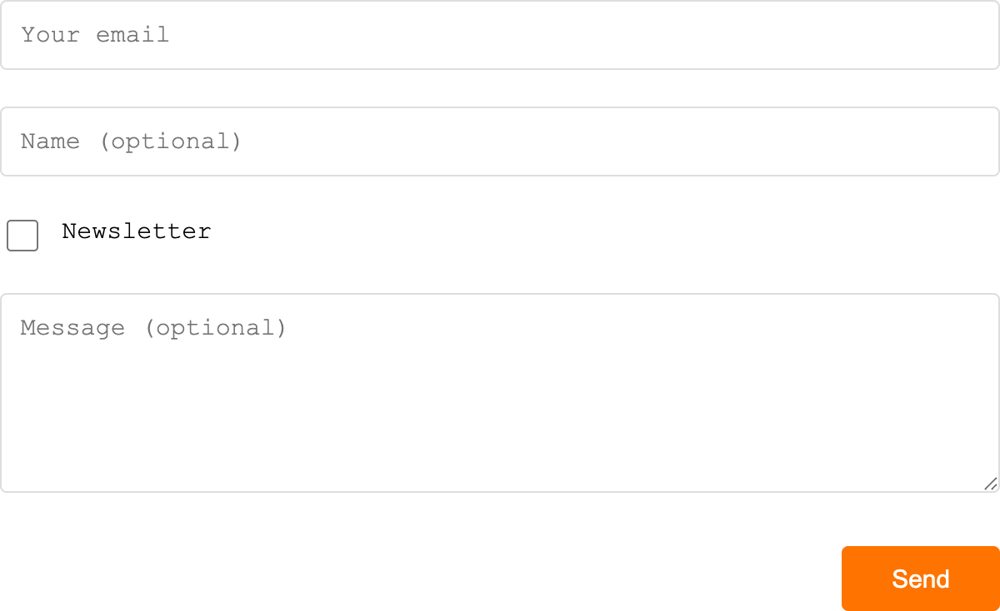

*The screenshot above shows `newsletter="true"`. Without the newsletter parameter, the checkbox row is hidden.*

---

## formspree

Contact form using Formspree as the backend. Simpler alternative to `contactform` — no CAPTCHA, no self-hosting required.

### Parameters

| Parameter | Required | Description |
|-----------|----------|-------------|
| `id` | Yes | Formspree form ID |

### Usage

```markdown

```

### Visual Examples

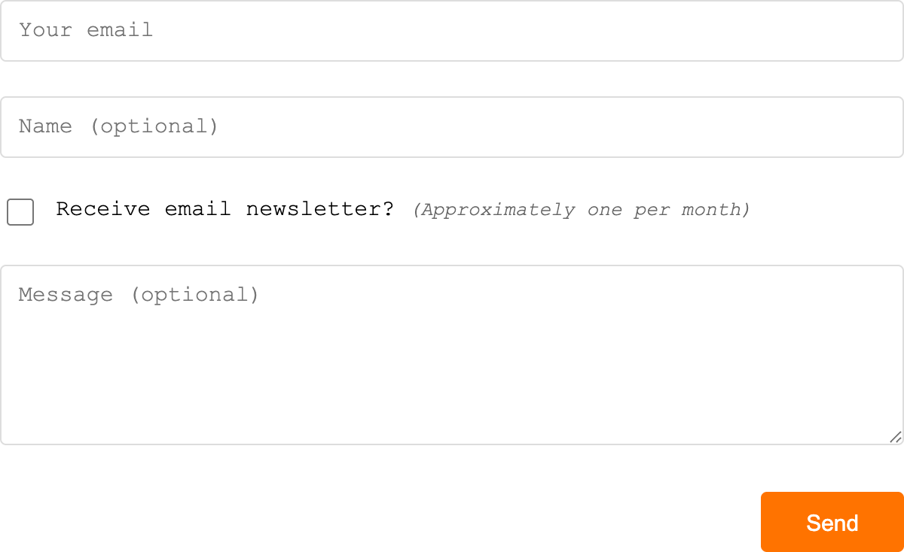

---

## rawhtml

Pass through raw HTML without markdown processing. Use for embedding widgets, iframes, or any HTML that Hugo's markdown renderer would alter.

### Parameters

| Parameter | Required | Description |
|-----------|----------|-------------|
| Inner content | Yes | Raw HTML content |

### Usage

```markdown

<div class="custom-widget">
  <iframe src="https://example.com/embed"></iframe>
</div>

```

### Visual Examples


---

## section-list

Renders a navigation list of site sections with chevron icons. Behaviour is consistent on any page (homepage, section pages, single pages).

### Parameters

| Parameter | Required | Description |
|-----------|----------|-------------|
| `sections` | No | Comma-separated section names (defaults to `site.Params.mainSections`) |
| `limit` | No | Number of recent items to show per section |

### Usage

```markdown



```

### Visual Examples


---

## img

Inline image for embedding within article text. Generates responsive thumbnails with WebP support, matching gallery behaviour.

### Parameters

| Parameter | Required | Description |
|-----------|----------|-------------|
| `src` | Yes | Image filename (from page resources) |
| `alt` | Yes | Alt text for accessibility |
| `caption` | No | Caption text below image |
| `position` | No | Placement: `left`, `right` (default), or `center` |
| `width` | No | Width when floated (default: `40%`) |
| `blur` | No | Set to `"true"` for blurred caption background |
| `opacity` | No | Caption background opacity override |

### Usage

```markdown




```

### Visual Examples

*Screenshots require a page bundle with image resources. See the example site's articles for working demonstrations.*

---

## gallery

Displays page image resources as a responsive gallery with lightbox support.

### Parameters

| Parameter | Required | Description |
|-----------|----------|-------------|
| `exclude` | No | Comma-separated filenames to exclude from gallery |

### Metadata Priority

1. Frontmatter resource params (`title`, `caption`, `alt`, `weight`)
2. EXIF data (`DocumentName` → title, `ImageDescription` → caption)
3. Filename (fallback)

### Frontmatter Configuration

```yaml
resources:
  - src: "*.jpg"
    params:
      weight: 10
  - src: "special.jpg"
    params:
      title: "Custom Title"
      caption: "Custom caption"
```

### Usage

```markdown



```

Use `exclude` when you have images displayed inline (via `img` shortcode) that you don't want duplicated in the gallery grid.

### Visual Examples

*Gallery screenshots require image files in a page bundle directory. Add `.jpg` or `.png` files to a page bundle alongside `_index.md` to see the gallery in action.*

---

## Screenshot Key

Screenshots are captured from the example site at 1200px viewport width (2x device scale) using Puppeteer, and placed in `screenshots/shortcodes/`. Dark mode variants are provided where the shortcode appearance changes between modes.

Shortcodes not yet screenshotted (require page bundle assets in the example site):

- `ga` — needs example content with `` shortcode usage
- `img` — needs image files in a page bundle
- `gallery` — needs image files in a page bundle
