# Shortcodes Reference

The tadg_ie theme provides 15 custom shortcodes for varied content types.

## Table of Contents

1. [callout](#callout) — Styled alert/notice boxes
2. [colorbold](#colorbold) — Inline accent-coloured bold text
3. [details](#details) — Collapsible content
4. [dialogue](#dialogue) — Character speech for plays
5. [direction](#direction) — Stage directions
6. [ga](#ga) — Inline Irish language text
7. [popquote](#popquote) — Expandable quotes
8. [poem](#poem) — Poetry with preserved line breaks
9. [video](#video) — HTML5 video player
10. [contactform](#contactform) — Self-hosted contact form with CAPTCHA
11. [formspree](#formspree) — Formspree-backed contact form
12. [rawhtml](#rawhtml) — Raw HTML pass-through
13. [section-list](#section-list) — Section navigation list
14. [img](#img) — Inline image with responsive thumbnails
15. [gallery](#gallery) — Image gallery with lightbox

---

## callout

Styled alert/callout boxes with colour-coded types.

### Parameters

| Parameter | Required | Description |
|-----------|----------|-------------|
| `type` | Yes | One of: `tip`, `alert`, `warning`, `custom` |
| `text` | Yes | Message content |
| `title` | No | Custom title (only for `type="custom"`) |
| `style` | No | Inline CSS (only for `type="custom"`) |

### Usage

```markdown




```

### Visual Examples

#### Light mode

| Tip | Alert |
|-----|-------|
| 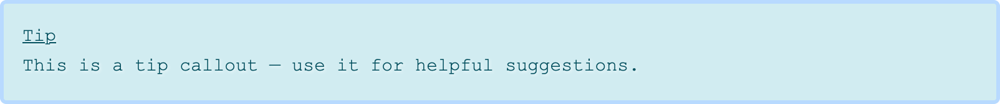 |  |

| Warning | Custom |
|---------|--------|
| 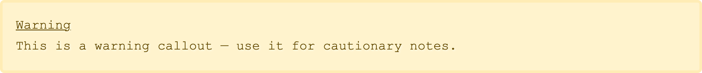 | 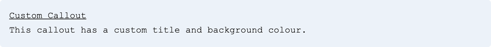 |

#### Dark mode

| Tip | Alert |
|-----|-------|
|  |  |

| Warning | Custom |
|---------|--------|
|  | 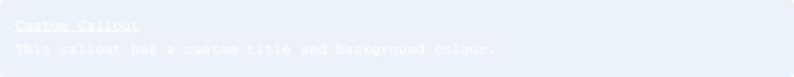 |

---

## colorbold

Inline text rendered in the secondary accent colour (`--color-secondary`) and bold. Underlined by default. Designed for emphasis within a sentence.

### Parameters

| Parameter | Required | Description |
|-----------|----------|-------------|
| First positional or `text` | Yes | Text to display |
| `underlined` | No | Set to `"false"` to remove underline (default: `true`) |

### Usage

```markdown
Are these only  I'm meant to frame?
This has  here.
```

### Visual Examples


---

## details

Collapsible content block. Closed state shows an ellipsis hint; open state reveals full content.

### Parameters

| Parameter | Required | Description |
|-----------|----------|-------------|
| First positional | Yes | Summary/title text (supports markdown) |
| Inner content | Yes | Body content (supports markdown) |

### Usage

```markdown

Hidden content goes here.
Can include **markdown**.

```

### Visual Examples

| Collapsed | Expanded |
|-----------|----------|
|  | 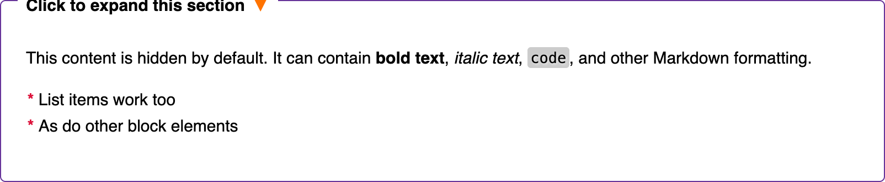 |

---

## dialogue

Character speech for plays and screenplays. Character name renders in small caps with optional parenthetical (delivery direction) in italics.

### Parameters

| Parameter | Required | Description |
|-----------|----------|-------------|
| First positional or `name` | Yes | Character name |
| Second positional or `parenthetical` | No | Delivery direction |
| Inner content | Yes | Dialogue text |

Supports both positional and named parameters.

### Usage

```markdown
Please don't shake off the water!
You've waited since yesterday, Tom.
Oh is that all?
```

### Visual Examples

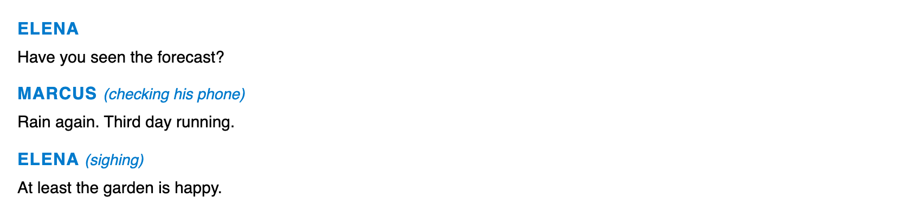

---

## direction

Stage directions for plays. Renders in italics with secondary accent colour.

### Parameters

| Parameter | Required | Description |
|-----------|----------|-------------|
| Inner content | Yes | Stage direction text (supports markdown) |

### Usage

```markdown
A bare stage. Single chair centre. TOM enters.
Pause.
```

### Visual Examples

| Light mode | Dark mode |
|------------|-----------|
| 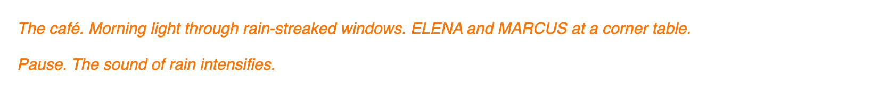 |  |

---

## ga

Inline Irish language text. Wraps content in `<span lang="ga">`, triggering the `:lang(ga)` CSS rule which applies Iosevka Gaeilge (wedge serif variant). Use this for Irish words or phrases within English text. For whole articles in Irish, use `contentLang: ga` in front matter instead.

### Parameters

| Parameter | Required | Description |
|-----------|----------|-------------|
| Inner content | Yes | Irish language text |

### Usage

```markdown
He greeted her with Dia duit, a chara as she entered.
The word craic has no direct English equivalent.
```

### Visual Examples

*Screenshot requires example content using the `ga` shortcode. Add `Dia duit` to a page to see Iosevka Gaeilge rendering.*

---

## popquote

Expandable quote using the same collapsible styling as `details`.

### Parameters

| Parameter | Required | Description |
|-----------|----------|-------------|
| First positional | Yes | Opening/summary text |
| Inner content | Yes | Full quote content (supports markdown) |

### Usage

```markdown

Full quote content here.
Multiple paragraphs supported.

```

### Visual Examples

| Collapsed | Expanded |
|-----------|----------|
|  | 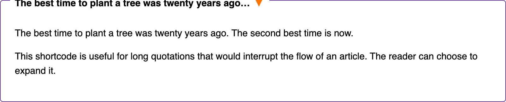 |

---

## poem

Poetry formatting with preserved line breaks. Newlines in source convert to `<br />` tags so verse structure is maintained.

### Parameters

| Parameter | Required | Description |
|-----------|----------|-------------|
| Inner content | Yes | Poem text with line breaks |

### Usage

```markdown

Roses are red,
Violets are blue,
This preserves
Line breaks for you.

```

### Visual Examples

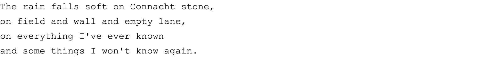

---

## video

Embed video — either local files via HTML5 `<video>` or Cloudflare Stream videos via iframe. The shortcode auto-detects the source type from the argument.

### Detection Logic

- **32-character hex string** (positional or `id` named param) → Cloudflare Stream iframe embed
- **Anything else** (file path or URL) → local HTML5 `<video>` player

### Parameters

**Local video (positional):**

| Parameter | Required | Description |
|-----------|----------|-------------|
| First positional | Yes | Video file path or URL |

**Cloudflare Stream (positional — no player options):**

| Parameter | Required | Description |
|-----------|----------|-------------|
| First positional | Yes | 32-character Cloudflare Stream video UID |

**Cloudflare Stream (named — with player options):**

| Parameter | Required | Description |
|-----------|----------|-------------|
| `id` | Yes | 32-character Cloudflare Stream video UID |
| `autoplay` | No | Auto-start playback (`true`/`false`) |
| `muted` | No | Start muted (`true`/`false`) |
| `loop` | No | Repeat on end (`true`/`false`) |
| `controls` | No | Show player controls (default: `true`) |
| `preload` | No | Browser preload hint (`none`, `metadata`, `auto`) |
| `poster_image` | No | Thumbnail shown before playback — see [Poster Image Resolution](#poster-image-resolution) |
| `startTime` | No | Start at specific time (e.g. `1m30s`) |
| `primaryColor` | No | Player UI accent colour (URI-encoded CSS) |
| `letterboxColor` | No | Player background colour (URI-encoded CSS) |

**Note:** Hugo shortcodes do not allow mixing positional and named parameters. Use all-named syntax (`id="..."`) when you need player options.

### Site Configuration (Cloudflare Stream)

Cloudflare Stream requires a customer code in `hugo.yaml`:

```yaml
params:
  cloudflareStream:
    customerCode: "YOUR_CUSTOMER_CODE"
```

The customer code is the public subdomain identifier visible in all embed URLs — it is not a secret.

### Usage

**Local video:**

```markdown

```

**Cloudflare Stream (simple):**

```markdown

```

**Cloudflare Stream (with options):**

```markdown



```

### Video in Page Layouts (Issue #43)

In addition to the shortcode, Cloudflare Stream videos can be used as the primary visual in page layouts via the `video` frontmatter field. This places the video in the layout's media slot (where `image` would normally go).

#### Frontmatter Schema

```yaml
video:
  id: "fd20681eb60dc4cc9c2058f30b977a7a"   # CF Stream UID (required)
  caption: "Open Your Heart"                # optional
  width: 1080                               # optional — see Dimension Resolution below
  height: 1920                              # optional — see Dimension Resolution below
  poster_image: toast.jpg                   # optional — see Poster Image Resolution below
  autoplay: true                            # optional
  muted: true                               # optional
  loop: true                                # optional
  controls: true                            # optional (default: true)
  preload: "auto"                           # optional
  startTime: "5"                            # optional, seconds
  primaryColor: "#ff6600"                   # optional
  letterboxColor: "#000000"                 # optional
```

> **Boolean params and CF defaults:** Pass `true` to enable a feature. Omit the field (or set `false`) to use Cloudflare's default. Setting a boolean param to `false` is equivalent to not setting it — the param is not forwarded to the player URL.

#### Compatible Layouts

| Layout | Behaviour |
|--------|-----------|
| `hero` | Video floats right, text wraps around it |
| `featured` | Video centred above content |
| `featured-columns-left` / `columns` | Video in left column, text in right |
| `featured-columns-right` | Text in left column, video in right |

**Incompatible layouts:** `banner` and `background` (default when `image` is set without a layout). These produce a Hugo build warning if `video` is present.

#### Dimension Resolution

The video container's `aspect-ratio` is resolved in this order:

1. **Frontmatter** — `video.width` and `video.height` if both are present
2. **Video inventory** — `data/video-inventory.yaml` in the site root, keyed by UID (`where .videos "uid" $id`)
3. **Cloudflare Stream API** — fetched at build time when `CLOUDFLARE_API_TOKEN` and `CLOUDFLARE_ACCOUNT_ID` are set. Both vars must be listed under `security.funcs.getenv` in `hugo.yaml`. When the vars are absent, this step is silently skipped
4. **CSS default** — 16:9 (`aspect-ratio: 16 / 9` in the stylesheet); no inline style is added

For the inventory lookup to work, add a `data/video-inventory.yaml` to the site root with this format:

```yaml
videos:
  - uid: "fd20681eb60dc4cc9c2058f30b977a7a"
    width: 1080
    height: 1920
```

The upload script in the content repo (`scripts/upload-video.sh`) writes this format automatically.

#### Poster Image Resolution

The `poster_image` field sets a thumbnail shown in the CF player before the video plays. It is appended to the embed URL as `?poster=[url]`.

The value is resolved to an absolute URL based on its format:

| Format | Example | Resolved as |
|--------|---------|-------------|
| Relative filename (no leading `/`) | `toast.jpg` | `[page.Permalink]toast.jpg` |
| Site-root-relative (leading `/`) | `/images/thumb.jpg` | `[site.BaseURL]images/thumb.jpg` |
| Absolute URL | `https://cdn.example.com/thumb.jpg` | Used verbatim |

**Priority chain:**

1. Frontmatter `poster_image` (or shortcode `poster_image` param)
2. `poster_image` in `data/video-inventory.yaml` for the matching UID — must be an absolute URL
3. No poster — CF Stream default (first frame of video)

**Inventory format:**

```yaml
videos:
  - uid: "fd20681eb60dc4cc9c2058f30b977a7a"
    width: 1080
    height: 1920
    poster_image: "https://tadg.ie/poetry/secrets/open-your-heart/toast.jpg"
```

The inventory `poster_image` must be an absolute URL — the upload script cannot populate it automatically since it is site- and page-specific.

#### Precedence

If both `video` and `image` are set, `video` takes precedence in compatible layouts. A build warning is emitted noting the conflict.

#### Examples

**Hero with video:**

```yaml
---
title: "My Post"
layout: hero
video:
  id: "fd20681eb60dc4cc9c2058f30b977a7a"
  autoplay: true
  muted: true
  loop: true
---
```

**Columns with video:**

```yaml
---
title: "My Post"
layout: featured-columns-left
video:
  id: "fd20681eb60dc4cc9c2058f30b977a7a"
  caption: "Open Your Heart"
---
```

**Featured with video:**

```yaml
---
title: "My Post"
layout: featured
video:
  id: "fd20681eb60dc4cc9c2058f30b977a7a"
---
```

### Visual Examples

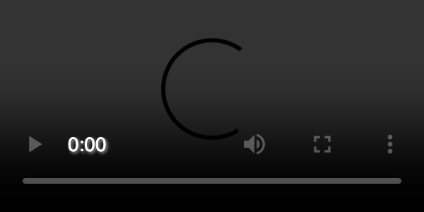

---

## contactform

Self-hosted contact form with Cloudflare Turnstile CAPTCHA, Worker backend, and optional newsletter signup.

Requires Cloudflare Worker deployment and Hugo configuration. See [contactform.md](contactform.md) for the full setup guide.

### Parameters

| Parameter | Required | Description |
|-----------|----------|-------------|
| `newsletter` | No | Set to `"true"` to show newsletter checkbox |

### Site Configuration Required

```yaml
params:
  contactform:
    worker_url: "https://your-worker.example.workers.dev"
    turnstile_sitekey: "0x..."
```

### Usage

```markdown


```

### Visual Examples

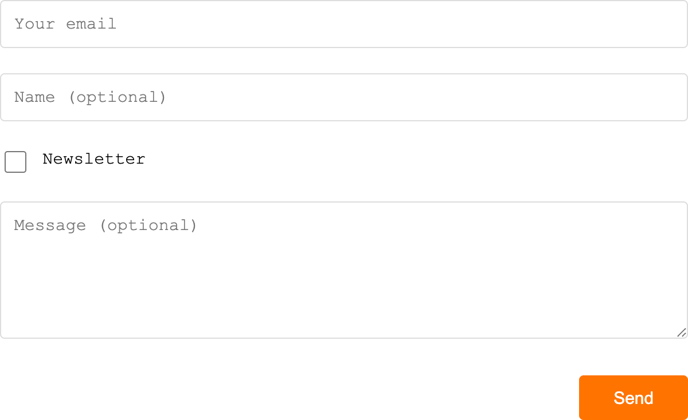

*The screenshot above shows `newsletter="true"`. Without the newsletter parameter, the checkbox row is hidden.*

---

## formspree

Contact form using Formspree as the backend. Simpler alternative to `contactform` — no CAPTCHA, no self-hosting required.

### Parameters

| Parameter | Required | Description |
|-----------|----------|-------------|
| `id` | Yes | Formspree form ID |

### Usage

```markdown

```

### Visual Examples

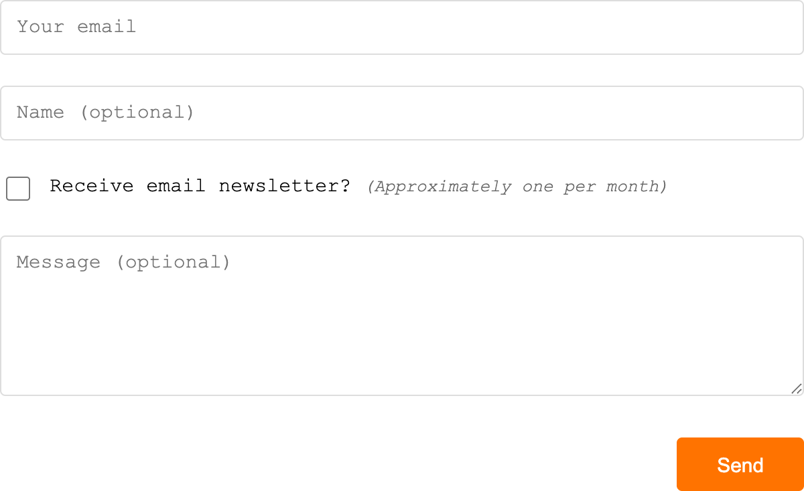

---

## rawhtml

Pass through raw HTML without markdown processing. Use for embedding widgets, iframes, or any HTML that Hugo's markdown renderer would alter.

### Parameters

| Parameter | Required | Description |
|-----------|----------|-------------|
| Inner content | Yes | Raw HTML content |

### Usage

```markdown

<div class="custom-widget">
  <iframe src="https://example.com/embed"></iframe>
</div>

```

### Visual Examples


---

## section-list

Renders a navigation list of site sections with chevron icons. Behaviour is consistent on any page (homepage, section pages, single pages).

### Parameters

| Parameter | Required | Description |
|-----------|----------|-------------|
| `sections` | No | Comma-separated section names (defaults to `site.Params.mainSections`) |
| `limit` | No | Number of recent items to show per section |

### Usage

```markdown



```

### Visual Examples

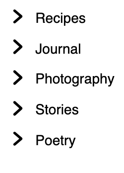

---

## img

Inline image for embedding within article text. Generates responsive thumbnails with WebP support, matching gallery behaviour.

### Parameters

| Parameter | Required | Description |
|-----------|----------|-------------|
| `src` | Yes | Image filename (from page resources) |
| `alt` | Yes | Alt text for accessibility |
| `caption` | No | Caption text below image |
| `position` | No | Placement: `left`, `right` (default), or `center` |
| `width` | No | Width when floated (default: `40%`) |
| `blur` | No | Set to `"true"` for blurred caption background |
| `opacity` | No | Caption background opacity override |

### Usage

```markdown




```

### Visual Examples

*Screenshots require a page bundle with image resources. See the example site's articles for working demonstrations.*

---

## gallery

Displays page image resources as a responsive gallery with lightbox support.

### Parameters

| Parameter | Required | Description |
|-----------|----------|-------------|
| `exclude` | No | Comma-separated filenames to exclude from gallery |

### Metadata Priority

1. Frontmatter resource params (`title`, `caption`, `alt`, `weight`)
2. EXIF data (`DocumentName` → title, `ImageDescription` → caption)
3. Filename (fallback)

### Frontmatter Configuration

```yaml
resources:
  - src: "*.jpg"
    params:
      weight: 10
  - src: "special.jpg"
    params:
      title: "Custom Title"
      caption: "Custom caption"
```

### Usage

```markdown



```

Use `exclude` when you have images displayed inline (via `img` shortcode) that you don't want duplicated in the gallery grid.

### Visual Examples

*Gallery screenshots require image files in a page bundle directory. Add `.jpg` or `.png` files to a page bundle alongside `_index.md` to see the gallery in action.*

---

## Screenshot Key

Screenshots are captured from the example site at 1200px viewport width (2x device scale) using Puppeteer, and placed in `screenshots/shortcodes/`. Dark mode variants are provided where the shortcode appearance changes between modes.

Shortcodes not yet screenshotted (require page bundle assets in the example site):

- `ga` — needs example content with `` shortcode usage
- `img` — needs image files in a page bundle
- `gallery` — needs image files in a page bundle
